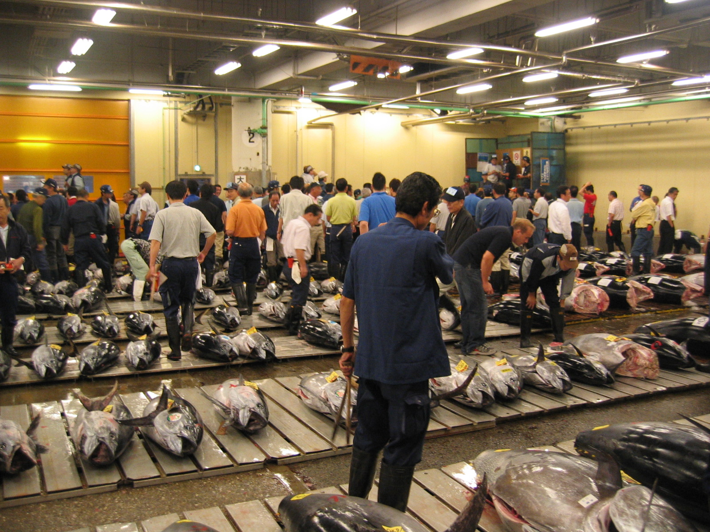
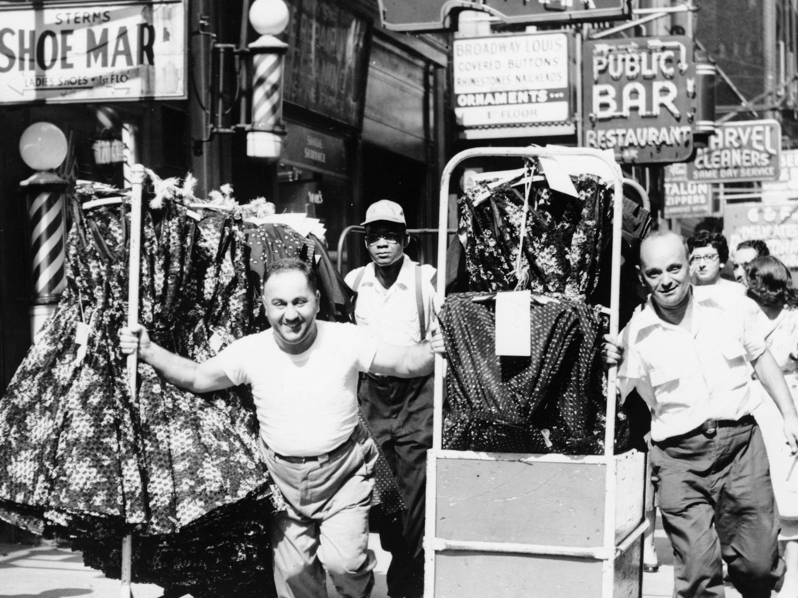
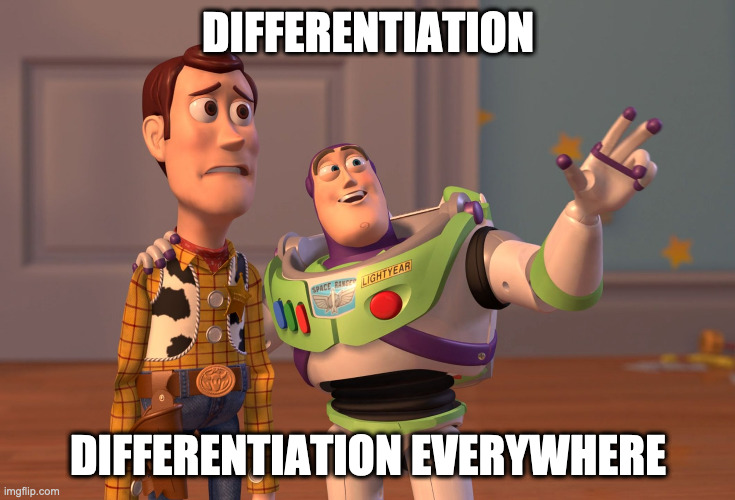

# Product Differentiation

## Price Wars Recap

-   We saw in the Shrimp game how rough rivalry can be
-   First way out: **Cooperation**
    -   But this is very difficult to maintain!
    -   ... and it's illegal to be too cooperative (i.e. collusive)
-   Second way out: **Differentiation**
    -   (Not possible in the Shrimp game)
    -   Avoid this kind of competition altogether

## Differentiation Principles

-   Hotelling: In a frictionless world, maybe you wouldn't want to differentiation
    -   **Minimal Differentiation Principle**
-   Salop: ... but this result is bunk in practice!
    -   It's only true when there's only one force (being near customers)
    -   Once you introduce almost *any other force*, you get...
    -   **Maximal Differentiation Principle**

## Strong and Weak Forces

-   For example, suppose you choose location, then compete on price
    -   Strong incentives to avoid colocating near rivals
    -   'Location' isn't (necessarily) physical/geographic
-   In practice, look for the forces that matter the most quantitatively
    -   Price war is usually a strong force, want to avoid!!
    -   Geographic differentiation is usually a weak force since it's offset by agglomeration effects
        -   Consumers want to go where the shops are
        -   e.g. Fulton Fish Market, soda vending machines, airport car rentals, etc
        -   Fashion Districts!

### Fish and Fashion

## Thinking Outside the Box

Sometimes it just takes a bit of creativity to figure out how to differentiate yourself: https://www.tiktok.com/@planetmoney/video/6890184198590663941

-   These ideas are very general. Some examples we saw
    -   Casinos and brewers offering very different products to same customers
        -   So it even applies to differentiating one of your products from another!
    -   Political platform polarization principles
        -   When turnout is a strong force
        -   Fun question to look into: Does lower turnout cause higher polarization?

-   ...
    -   Within narrowly-defined markets!
-   Ritz-Carlton competes with other luxury hotels
    -   But highly differentiated!
    -   And an entire operations strategy to fit this

> Ladies and Gentlemen serving Ladies and Gentlemen

## Strategic Takeaways

-   Differentiation is relative, so it's intrinsically dependent on what your competitors are doing
-   How much should Ritz-Carlton care about process failures?
    -   How much do they happen elsewhere?
    -   What is the customer expecting?
    -   How valuable would it be to correct these problems?

## Next Week: Reasoning Through What They Will Do

>   Deterrence is the art of producing in the mind of the enemy the fear to attack