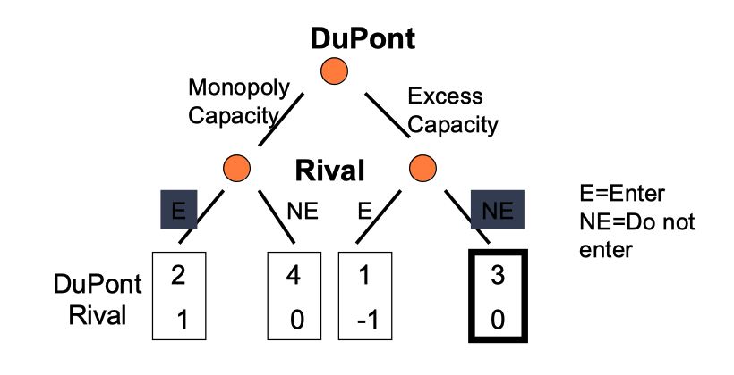
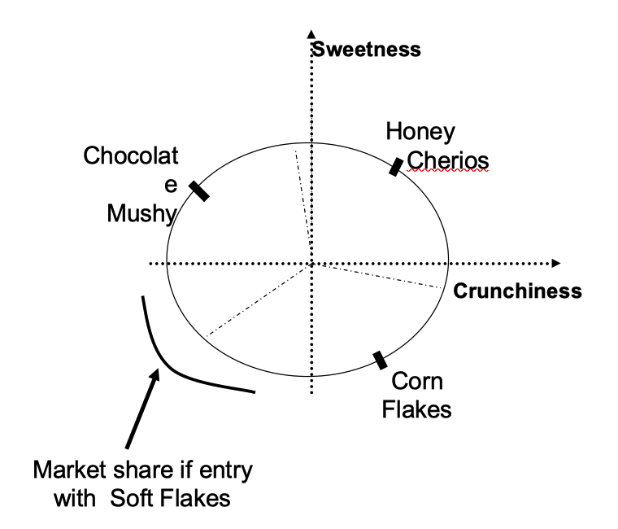

# Entry and Deterrence

## Entry Strategy Recap

-   High profits incentivize entry (Industry Analysis)
    -   So what's stopping firms?
-   Strong incentives to deter!
    -   Monopolist earns more than two duopolists put together
        -   Best the duopolists can do is collude!
    -   Monopolist Profit - Duopolist Profit > Duopolist Profit
        -   If entry, Monopolist Loss > Entrant Gain
-   Week 6 focus: Strategic/endogenous BTEs 
    -   Reputation
    -   Signaling
        -   Fighting
        -   Excess Capacity (in this note)
    -   Product Proliferation (in this note)
        -   Cereal characteristics
        -   Sleeping patents (check out Rank Xerox!)
        -   Airport space (British Airways in London)

## Deterrence Toolbox Addendum

(Not predation!)

### Signaling: Excess Capacity

-   Adding capacity can deter entry
-   Allows incumbent to expand output quickly/cheaply
-   Credible signal of a price war response to entry
-   ... but isn't optimal without deterrence effect!
-   An Antitrust Example: *United States v Alcoa*
    -   Aluminum monopolist through 1940
    -   Built 'too many' plants and signed big exclusive contracts with input producers
    -   Both forms of excess capacity commitments to deter entry

#### Game Theory Example

### Proliferation: Connection to Product Differentiation

-   Entry deterrence by making 'too many' products
    -   Leave no room for entrant’s product
-   Using product differentiation for evil?
    -   Dense product space means entrants can't differentiate themselves
    -   Only option is (unprofitable) tough price competition
-   Examples
    -   Airlines (departure times)
    -   Big Pharma
    -   Ready-To-Eat breakfast cereals

#### Game Theory Example

## Judo Economics

-   Enter small!
    -   Incumbent does not have incentive to lower price to compete
    -   Gains back some customers, but loses revenue per customer (see below)
-   Need to communicate credibly
    -   Example: Build small plant

## Ryanair Takeaways

-   Costs and competition
    -   Ryanair's competitive advantage is on the cost side
    -   Low marginal costs means price wars especially bad!
-   Targeted responses

    -   Less costly response since incumbent doesn't lose as much revenue per customer (see above)
    -   Complex airline pricing gives a lot of flexibility to target
-   Judo Economics?

    -   Ryanair's initial entry ignored these principles!
    -   Went after Air Lingus's most profitable route
        -   Clear intention to expand further
-   ... and the Ryan brothers [paid the price](https://youtu.be/htBPPT1TW4g)!

## Next Part of the Course

1.  What makes some firms more efficient, anyway?
2.  How much should you do 'in-house'?
3.  Anything special about 'tech'?

> Life is never stagnation.