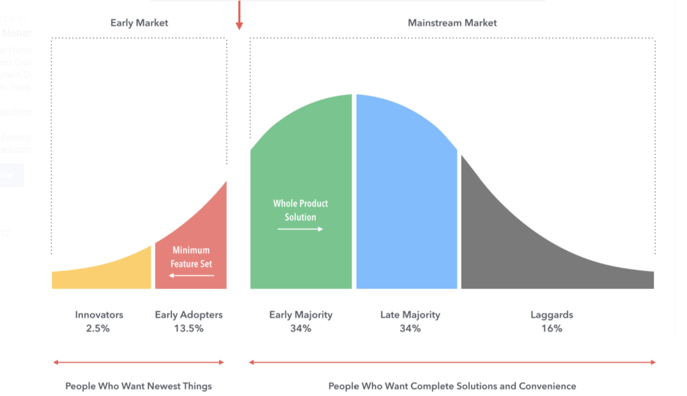

# Productivity

-   Lecture: How are moments of disruption different? What are the economic implications?
-   Discussion: What are productivity improvements? How are they diffused? How are they sustained?

This note is mostly about subtopics that didn't make it into the lecture because of shortened time.

## S-Curves and the Chasm

If you visualize the S-Curve as a wave, you can see where the Chasm is -- right before the takeoff point. A key challenge is predicting (and successfully directing) when and how much this jump happens.

## Tradeoffs in Mechanisms for Capturing Value

The following is an outline of tradeoffs to consider for how you should try to capture value for your innovation. Which of these mechanisms is best depends on the specific setting -- generally look for when the strengths are particularly useful, and the weaknesses aren't particularly problematic.

-   Intellectual Property Protection
    -   Strengths
        -   Legal right, can be traded
        -   Buys time to build complementary assets
        -   Slows competitors down
    -   Weaknesses
        -   Costly to enforce
        -   Can be invented around
        -   Not everything can be patented
-    Secrecy and Non-Compete Clauses
    -   Strengths
        -   Cheap
        -   Easy
        -   No disclosure
    -   Weaknesses
        -   Costly to enforce
        -   Difficult to maintain
        -   Good technical people often do not want their work shrouded in secrecy
-   Speed and Natural First-Mover Advantage
    -   Strengths
        -   Competitors cannot catch up
        -   Costly to imitate
        -   Quick profits
    -   Weaknesses
        -   Over soon
        -   Diminishing returns
        -   Difficult to pull off and sustain

### Example: Intellectual Property Protection for Windshield Wipers

-   1962: Robert Kearns invented a little wiperswitch that made the intermittent wiper possible
    -   Fitted car with it and drove it to Ford
    -   Ford passed on innovation
    -   Kearns obtained patents
-   1969: Ford and others cracked secret
-   1990: Kearns wins suit against Ford for potential damages payout of 325 million (eventually gets 8 million)

## Complementary Assets $\Rightarrow$ Profits

Complementary assets are those necessary to translate an innovation into commercial returns. 

### Example: Complementary Assets in the Typesetter Industry

-   Waves of innovation
    -   1440: manual, Gutenberg
    -   1886: ‘hot metal’ linotype machine
    -   1949: analog phototypesetting
    -   1965: digital CRT phototypesetting
    -   1976: laser imagesetting
-   One firm, Mergenthaler Linotype, survived as industry leader
-   Mergenthaler’s success
    -   1886: Mergenthaler founded
    -   1895: recognised need for new font development
    -   1902: library of over 100 fonts
    -   1913: 1000 typefaces
    -   1923: 200 typefaces
-   Would take 20 years for an entrant to duplicate
    -   With computers, it took cg a decade and $23 million to generate 1000 fonts
-   Key fonts trademarked: Helvetica, Palatino, Frutiger

## Addendum Between Productivity and Scope: Job Design

-   One of the most important sources of productivity in practice
-   Often intricately connected to how the firm is organized
-   Classical
    -   Specialization (Adam Smith)
    -   Best Practices (Frederick Taylor)
    -   Characteristics
        -   Low decision making
        -   Low skill
        -   Narrow tasks
        -   Small benefit of motivation
        -   Often in centralized structures
    
    -   Specialized managers or engineers decide best practices
    -   Workers specialize in narrow task, not broad decision making
-   Modern
    -   Intrinsic Motivation (Richard Hackman)
    -   Characteristics
        -   High decision making
        -   High skill
        -   Broad tasks
        -   Big benefit of motivation
        -   Often in decentralized structures
    -   Dynamic jobs intrinsically motivate with learning
    -   Think of how Ritz-Carlton manages their employees!

## Tech Tech Revolution

-   Question: How is automation changing job design?
-   Answer: Polarization!
-   Classical jobs
    -   Easier to find best practices
    -   Low skill jobs will rise (complement manual tasks)
    -   Mid skill jobs will fall (substitute routine tasks)
-   Modern jobs
    -   More dynamic environments
    -   High skill jobs will rise (complement abstract tasks)

## Takeaways

-   Productivity is vastly important for firm performance
-   What drives productivity varies considerably, but is often a mix of
    -   Management (Ritz-Carlton, Enterprise)
    -   Operations (Toyota)
    -   Culture (Toyota, Ritz-Carlton, Enterprise)
-   Innovations are discrete jumps in productivity, and follow S-Curves
    -   The takeoff point is nigh impossible to predict
    -   ... but you can be prepared!
-   In the end, capture goes to who controls the complementary assets

## Next Week

Coase framed the problem almost a century ago: Why have firms at all? (And this was before the gig economy!)

> Outside the firm, price movements direct production, which is coordinated through a series of exchange transactions on the market. Within a firm, these market transactions are eliminated and in place of the complicated market structure with exchange transactions is substituted the entrepreneur-coordinator, who directs production. It is clear that these are alternative methods of coordinating production. Yet, having regard to the fact that, if production is regulated by price movements, production could be carried on without any organization at all, well might we ask, why is there any organization?
